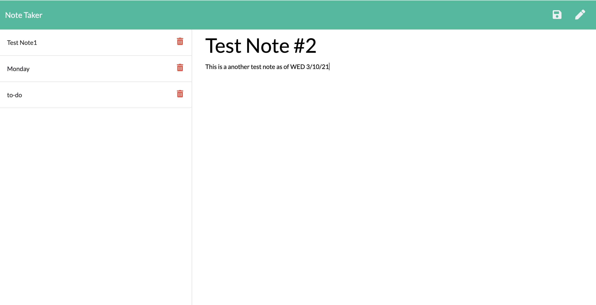

# Express-Note-Taker

## Summary:

This simple note taking application allows you to save notes with a title and plain text. 
Save notes by clicking the Save icon on the top of the page. 
Previously saved notes will be displayed on the left column and can deleted by clicking the Trash icon.

## Installing:

Clone the repository to your local development environment.

git clone https://github.com/irjaimes/express-note-taker.git
Navigate to the express-note-taker folder using the command prompt.

Run npm install to install all dependencies. To use the application locally, run node server.js in your CLI, and then open http://localhost:3000 in your preferred browswer. 

### Deployed Application: <https://xprss-notetkr.herokuapp.com/>
### Screenshot 

## Routes Implemented:
#### HTML routes:

* GET /notes - to return the notes.html file.

* GET / - to return the index.html file

* A db.json file is used on the backend to store and retrieve notes using the fs module.

#### API routes:

* GET /api/notes - to read the db.json file and return all saved notes as JSON.

* POST /api/notes - to recieve a new note to save on the request body, add it to the db.json file, and then return the new note to the client.

* DELETE /api/notes/:id - to recieve a query parameter containing the id of a note to delete. Using the fs module to rewrite the notes to the db.json file.

### Built With 
* Javascript
* NodeJS
* Node Packages:
    * Express

### Author
Idzel Jaimes

### License
This project is licensed under the ISC License.